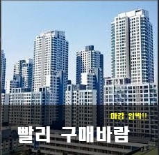

# Python Opencv Print Korean

> 스택오버플로우에 올라온 내용을 참고하였다.
>
> https://stackoverflow.com/questions/50854235/how-to-draw-chinese-text-on-the-image-using-cv2-puttextcorrectly-pythonopen

## Overview

### 1. 한글 삽입

opencv의 putText 함수는 utf-8를 지원하지 않기 때문에 pillow를 이용하여 삽입하였다.

### 2. 투명도 조절

opencv의 rectangle 함수는 alpha를 지원하지 않기 때문에 blending이라는 조금 번거로운 방법을 통하여 해결하였다. 이미지 두개를 생성하여 weighted를 조절하여 합쳤다.

### 3. Result




### Setting

```shell
$ pip install opencv-python
$ pip install pillow
```

### Code

```python
# #-*- coding: utf-8 -*-
import cv2
import numpy as np
from PIL import ImageFont, ImageDraw, Image

img = cv2.imread('apt3.jpg', cv2.IMREAD_COLOR)

overlay = img.copy()
height, width, p = img.shape
print(height)
print(width)

yellow = (0, 255, 255)
red = (0, 0, 255)
green = (0, 255, 0)
blue = (255, 0, 0)
white = (255, 255, 255)
yellow = (0, 255, 255)
cyan = (255, 255, 0)
magenta = (255, 0, 255)
black = (0, 0, 0)

blue = (255, 0, 0)
thickness = -1

# 하단부 배경 검은색
cv2.rectangle(overlay, (0, (int)(height * 2 / 3)),  (width, height), black, thickness)
alpha = 0.6  # Transparency factor.
img = cv2.addWeighted(overlay, alpha, img, 1 - alpha, 0)

# 글자 1
fontpath = "./HMKMRHD.TTF"
org = ((int)(width/10), (int)(height * 4 / 5))
font = ImageFont.truetype(fontpath, 25)
img_pil = Image.fromarray(img)
draw = ImageDraw.Draw(img_pil)
draw.text(org,  "빨리 구매바람", font = font, fill = white)

# 글자 2
org1 = ((int)(width * 7 / 10), (int)(height * 5 / 7))
font = ImageFont.truetype(fontpath, 10)
draw.text(org1,  "마감 임박!!", font = font, fill = yellow)
img = np.array(img_pil)

# show
cv2.imshow('dst', img)

# Destroy
cv2.waitKey()
cv2.destroyAllWindows()
```

